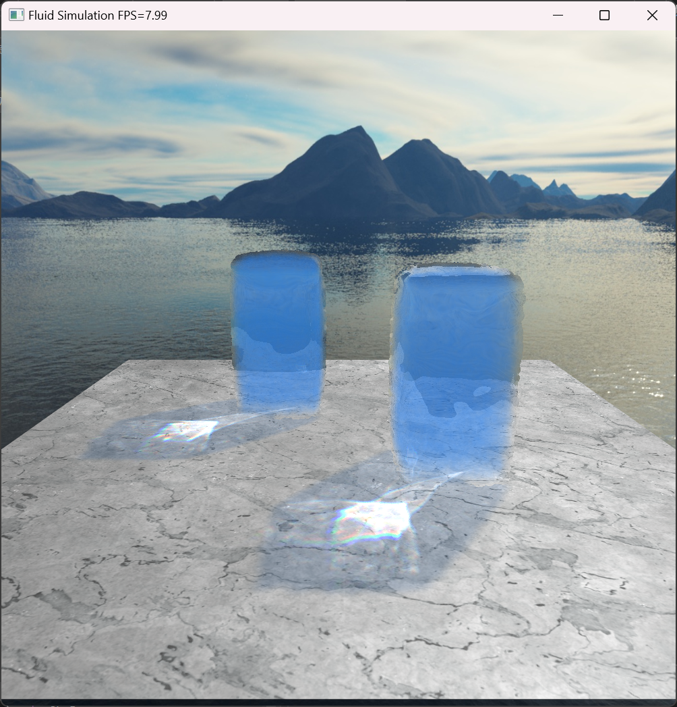
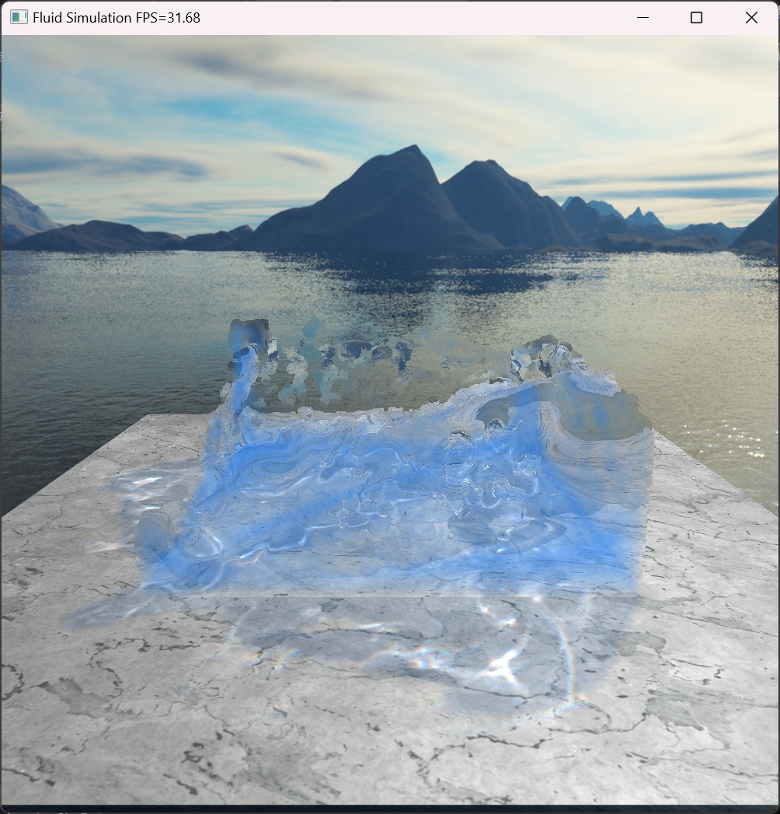
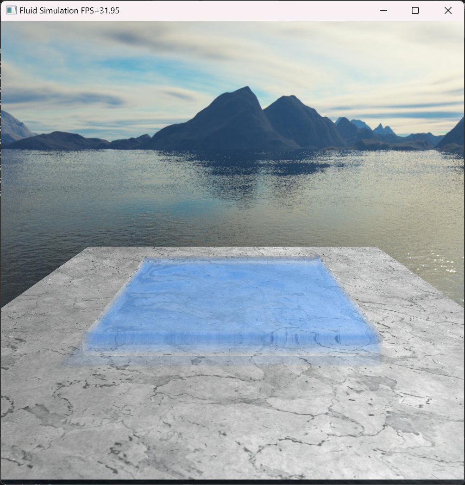
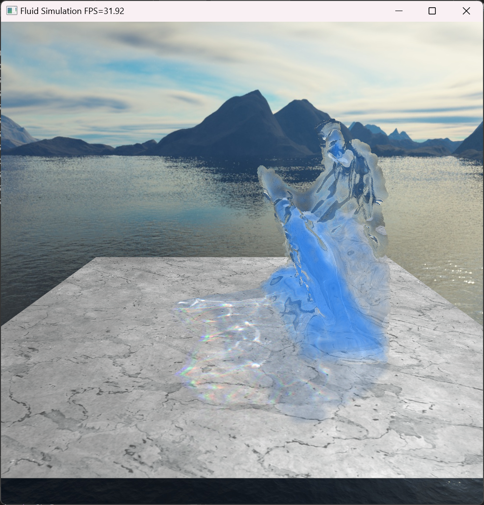
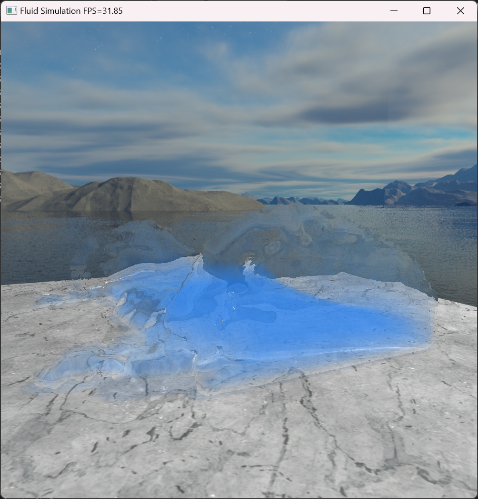
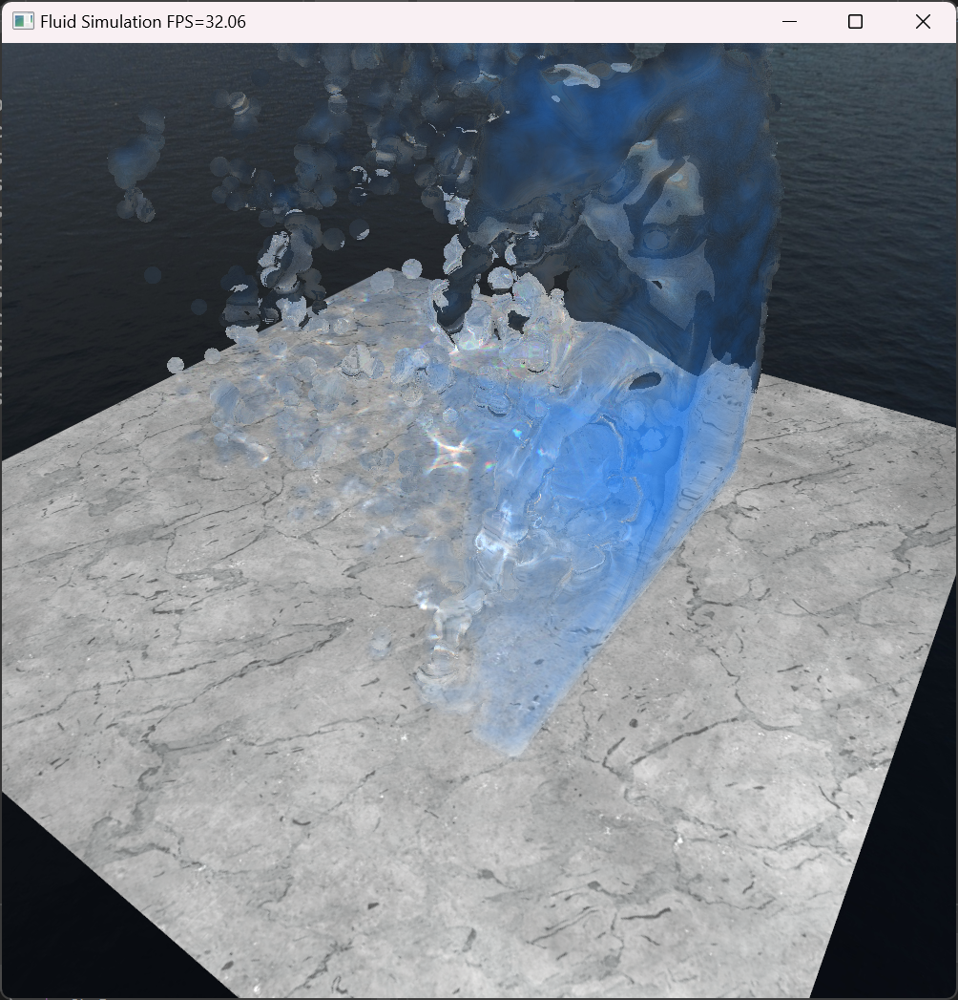

# Real-Time 3D Fluid Simulation

Major project for BCIT Computer Systems Technology Bachelor of Technology (BCIT CST BTech).

A real-time fluid simulation and rendering demo, which implements the Smoothed Particle Hydrodynamics (SPH) algorithm using OpenGL compute shaders. The rendering section utilizes screen-space techniques, including fluid rendering, real-time shadows, and real-time caustics, and incorporates mouse dragging for interactive control.

## Usage
To build project with Cmake, create build folder:
```bash
mkdir build
cd build
```
Run CMake to generate solution files:

```bash
cmake .. -G "Visual Studio 17 2022"
```
Open the sln file with Visual Studio and run.

Keyboard binding:

| Function             | Key                      |
|----------------------|--------------------------|
| Pause                | `[space]`                |
| Exit                 | `[esc]`                  |
| Camera rotation      | `mouse left button click`|
| Camera displacement  | `mouse right button click`|
| Camera zoom          | `mouse wheel`            |
| Drag fluid           | `mouse middle button click`|


## Gallery

### Runtime screenshot







## Related

Quick simulator by python:

[3D Fluid Simulator](https://github.com/guardhao104/3DFluidSimulator)
